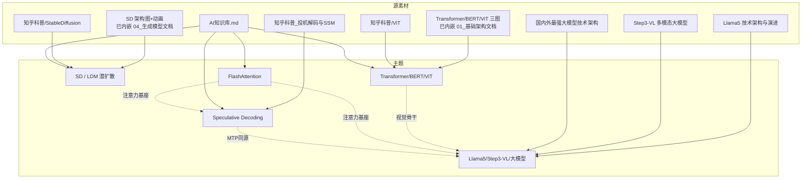
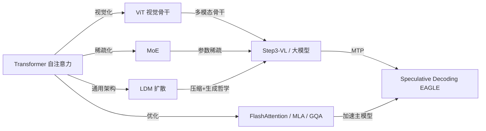

> 本文是 **C 形态**：不重写内容，只把现有 svg 图 / 知乎科普 / 长文档 / AI 知识库条目梳理成**可检索索引 + 关系图**，告诉你「手里有啥、怎么复用、从哪读起」。
>
> 📌 总入口 / 学习顺序大纲见 **`模型技术库/00_导读_由浅入深路线图.md`**（六阶段路线图 + 依赖关系 + 三条学习路线）。

---

## 一、资产清单（按主题归档）

### 主题 1 · Stable Diffusion / LDM 潜扩散
| 资产 | 类型 | 路径 | 用途 |
|------|------|------|------|
| LDM 架构图 | SVG（已内嵌） | `模型技术库/04_生成模型/StableDiffusion_LDM_潜扩散模型.md` | 三件套图 + 去噪动画 base64 内嵌正文，拷走/发邮件均不丢图 |
| 知乎科普 | md | `知乎科普/2026-07-16_StableDiffusion.md` | 爱好者可读版 + 工程哲学 |
| 知识库条目 | md | `AI知识库.md` → `2026-07-16` | 当日核心思想+算子+优化总览 |
| 邮件 HTML | html | `email_body_0716.html` / `email_body.html` | 当日推送正文 |

### 主题 2 · FlashAttention（FA-1→FA-4）
| 资产 | 类型 | 路径 | 用途 |
|------|------|------|------|
| 注意力图 base64 | txt | `att_b64_oneline.txt` / `att_b64_wrapped.txt` / `b64.txt` | 可转 SVG 嵌入 |
| 算子记录 | md | `算子讲解_sent.md` | 已讲解算子去重清单（MLA/FA） |
| 知识库条目 | md | `AI知识库.md` → `2026-07-16`「当日算子」 | 机制/收益/坑 |

### 主题 3 · Speculative Decoding（EAGLE / MTP）
| 资产 | 类型 | 路径 | 用途 |
|------|------|------|------|
| 知乎科普（深） | md | `知乎科普_投机解码与SSM状态.md` | 含 cu_seqlens/nacc 对齐 mermaid、混血坑 |
| 知识问答 HTML | html | `知识问答_投机解码状态推进.html` | 同源可视化版 |
| 知识库条目 | md | `AI知识库.md` → `2026-?7-16`「当日性能优化」 | EAGLE/MTP 机制与收益 |

### 主题 4 · Transformer / BERT / ViT
| 资产 | 类型 | 路径 | 用途 |
|------|------|------|------|
| 三张架构图（Transformer/BERT/ViT） | SVG(内嵌) | 已 base64 内嵌 `模型技术库/01_基础架构/Transformer_BERT_ViT.md` 正文 | Encoder-Decoder 全图 + Encoder-only + patch→token；单文件自包含 |
| 知乎科普 | md | `知乎科普/2026-07-15_ViT.md` | ViT 可读版 + MLA/PD 延伸 |
| 邮件 HTML | html | `email_bert_body.html` | BERT 推送正文 |
| 论文技术 HTML | html | `paper_transformer.html` / `paper_transformer_tech.html` | Transformer 技术解读 |
| 知识库条目 | md | `AI知识库.md` → `2026-07-15` | ViT + MLA + PD 分离 |

### 主题 5 · Llama5 / Step3-VL / 国内外大模型架构
| 资产 | 类型 | 路径 | 用途 |
|------|------|------|------|
| Llama5 长文档 | md | `模型技术库/06_大模型与多模态/Llama5_技术架构与演进.md` | MoE/RSI/演进/部署 |
| Step3-VL 科普 | md | `模型技术库/06_大模型与多模态/Step3-VL_多模态大模型.md` | VLM 全链路 + PaCoRe + RadixAttention |
| 国内外格局 | md | `模型技术库/06_大模型与多模态/国内外最强大模型技术架构_2026.md` | 四巨头+国产四强+选型速查 |
| 社区跟踪 | md | `每日跟踪_vLLM_SGLang_2026-07-16.md` 等 | MLA/PD/Spec 落地动态 |

---

## 二、知识地图（关系图）

---

## 三、知识依赖 DAG（谁支撑谁）

---

## 四、阅读路线建议

| 你的目标 | 建议起点 | 接着读 |
|----------|----------|--------|
| 零基础懂 AI 画图 | `知乎科普/2026-07-16_StableDiffusion.md` | `模型技术库/04_生成模型/StableDiffusion_LDM_潜扩散模型.md`（架构图+去噪动画已内嵌正文） |
| 搞懂长上下文为什么快 | `AI知识库.md` `2026-07-16`「当日算子」 | `模型技术库/03_高效注意力计算/FlashAttention_FA1至FA4.md` |
| 搞懂推理加速 | `知乎科普_投机解码与SSM状态.md` | `模型技术库/05_推理加速/SpeculativeDecoding_EAGLE_MTP.md` |
| 搞懂 Transformer 全家 | `知乎科普/2026-07-15_ViT.md` | `模型技术库/01_基础架构/Transformer_BERT_ViT.md`（三张架构图已内嵌正文） |
| 纵览 2026 大模型 | `模型技术库/06_大模型与多模态/国内外最强大模型技术架构_2026.md` | `模型技术库/06_大模型与多模态/Llama5_技术架构与演进.md` → `模型技术库/06_大模型与多模态/Step3-VL_多模态大模型.md` → 各 B 文档 |
| 写一篇完整技术 md | `模型技术总览_结构与原理解读.md`（A） | 按主题跳 `模型技术库/`（B/C） |

---

## 五、可复用图示速查
- **LDM 三件套**：架构图 + 去噪动画已 base64 内嵌 `04_生成模型/StableDiffusion_LDM_潜扩散模型.md`，拷走/发邮件均不丢图
- **Transformer 全家桶**：三张架构图（Encoder-Decoder 全 / Encoder-only / patch 流程）已 base64 内嵌 `01_基础架构/Transformer_BERT_ViT.md`，如需二次复用可从该文档正文提取 data-URI
- **注意力类图**：`att_b64_*.txt` / `b64.txt`（base64，转 SVG 即可嵌入邮件）
- 所有 svg 均 < 2KB，符合 QQ 邮箱 base64 内联上限，可直接复用进每日 AI 论文邮件。

---

*整理于 2026-07-17。本文件为索引性质，内容细节见被索引的源文件与 A/B 文档。*
