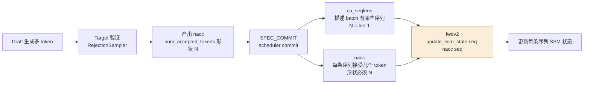

> 本文从最朴素的直觉出发，一步步拆到 vLLM-Kunlun 上 Qwen3Next 这类「注意力 + 状态空间模型（SSM）」混合架构做投机解码时，最容易踩、也最隐蔽的一个坑：**SSM 状态推进与「接受 token 数」的对齐**。适合对推理系统感兴趣、但不一定读过 vLLM 源码的同学。

你有没有注意过，和主流大模型对话时，它是「一个字一个字往外蹦」的？你发一句话，它要好一会儿才回第一个字，之后虽然快了，但本质仍是逐字生成。

这背后是一个叫**自回归（autoregressive）**的机制：模型每生成一个新 token，都得把之前所有的 token 重新「读」一遍，才能决定下一个写什么。换句话说——**每写一个字，就要把整本书重读一遍**。这当然慢。

有没有办法让它一次多写几个字？这就是「投机解码（Speculative Decoding）」要解决的问题。

## 一、投机解码：先打草稿，再一次性校对

想象你在写稿。正规流程是：写一字 → 通读全文 → 写下一字 → 再通读……慢得离谱。

投机解码换个思路：**先由一个小模型（或某种更便宜的策略）一口气「猜」出后面好几个字，当作草稿；然后让大模型一次性把这份草稿审完**。

- 猜对了 → 白赚，几个字直接采用，延迟只花了「审一遍」的代价；
- 猜错了 → 最多浪费一点点，大模型从第一个错处截断，重新接上正确的。

关键在于：**验证是并行的**。不管草稿猜 2 个字还是 8 个字，大模型都只要「跑一遍」就能判定哪些对、哪些错。所以「多猜」几乎不增加延迟，猜得越准，整体就越快。

衡量收益的核心指标叫**接受率（acceptance rate）**：草稿里有多少比例被大模型认可。接受率高，投机解码就划算；接受率低，反而亏（白猜还占算力）。

> 小问题：草稿从哪来？可以另训一个小模型专门当「草稿员」，也可以用更巧妙的办法——这就是下一节。

## 二、Suffix 投机：不另训模型，直接「抄」历史

「Suffix（后缀）投机」是一种零额外模型的投机策略。它的灵感很朴素：**你刚写过的 token 片段，后面很可能再出现**。

比如前文刚出现过「人工智能技术」，那么下一轮模型很可能继续接「人工智能」或「技术突破」。Suffix 策略就把历史上出现过的 token 后缀模式记到一张缓存里，每轮用最近几个 token 去匹配、复用，直接当作本轮的草稿。

好处是简单、不占显存、不用训小模型；代价是命中率高度依赖文本有没有规律可循。命不中时，草稿就是空的，投机退化为普通的逐字生成。

## 三、但 Qwen3Next 是个「混血」模型

到这里，故事都发生在「纯 Transformer」的假设下。可 Qwen3Next 这类新模型是**混血架构**：它既有标准的「全注意力（Full Attention）」层，又有 **GatedDeltaNet / 类 Mamba 的线性注意力（SSM）层**。

这两类层「记历史」的方式完全不同，而正是这个区别，让投机解码在它身上变麻烦了。

- **注意力层**：靠 **KV Cache** 记历史。你可以把它想成**便签纸**——每来一个 token，就贴一张便签；要回看时，把所有便签摊开读。
- **SSM / Mamba 层**：靠一个不断更新的**状态（state）**记历史。它不像便签那样「摊开」，而更像一本**不断续写的流水账**——每处理一个 token，账本就往前翻一页（状态递推一步），你手里永远只拿着「当前这页的摘要」，而不是全部历史。

对注意力层，接受几个 token，无非就是「保留几张便签」；对 SSM 层，接受几个 token，意味着这本流水账要**往前翻几页（状态递推几步）**。

## 四、关键来了：接受几个 token，状态就要推几步

一轮投机解码验证完，可能「接受」了 2 个草稿 token。于是：

- 注意力层：保留这 2 个 token 对应的 2 块 KV；
- SSM 层：状态要往前递推 **2 步**（具体是 `conv_state` 和 `ssm_state` 两个状态都各推 2 步）。

推多推少，完全取决于一句话：**这一轮到底接受了多少个 token？**

这个数字在 vLLM 里叫 `num_accepted_tokens`，简称 **nacc**。它是连接「验证结果」和「状态推进」的桥梁——nacc 是多少，SSM 状态就推多少步。

## 五、批量推理时：cu_seqlens 与 nacc 的对齐

线上推理不会一次只服务一条请求，而是把很多条**打包成一个 batch** 一起算。这时候就需要两个「维度一致」的量来描述这个 batch：

- **cu_seqlens**（cumulative sequence lengths，累积序列长度）：描述 batch 里每条序列的 token 边界。
  例如三条序列分别有 100 / 50 / 80 个 token，拼成一条扁平 buffer 后：

  ```
  cu_seqlens = [0, 100, 150, 230]
  N = len(cu_seqlens) - 1 = 3   # 当前 batch 有 3 条序列
  ```

  它回答：**「有哪些序列、数据在哪儿」**。

- **nacc**（num_accepted_tokens）：每条序列本轮各接受了多少个草稿 token，形状 `(N,)`。

  ```
  nacc = [2, 0, 3]
  # 第 0 条推进 2 步；第 1 条不推进；第 2 条推进 3 步
  ```

  它回答：**「每条序列推进几步」**。

在「落账」（Scheduler Commit）那一刻，二者汇合，一起喂给底层的状态更新算子（vLLM-Kunlun 里是 `fwdv2`）。算子对每条序列执行：

```text
for seq in range(N):
    update_ssm_state(seq, nacc[seq])
```

也就是说：**cu_seqlens 告诉算子「有谁」，nacc 告诉算子「每个推几步」**。二者都按「序列维」对齐，缺一不可。



## 六、错位的代价：nacc length mismatch，以及「看起来接受更多、其实更错」

一旦 nacc 和 cu_seqlens 对不上，算子就懵了。

最常见的报错是 **`nacc length mismatch`**。比如 `cu_seqlens` 长度为 65，说明有 64 条序列；但拿到的 `nacc` 长度却是 128——算子以为「64 条序列却有 128 个接受数」，无法一一对应，直接报错或状态错位。

更隐蔽的是**语义层面的错**。有人曾想把 `naccepted` 的算法从

```text
naccepted = len(generated_token_ids) - 1
```

改成「生成结果与调度草稿的前缀匹配长度」，以为这样能让「接受更多」。实测结果是：日志里 `naccepted` 看着大了，但**输出直接崩了**——出现泰文字符、乱码 `crement`、整段重复。原因在于，SSM 状态推进步数必须和「真实接受的 token 数」严格一致；前缀匹配数看似更大，却让状态多推（或少推）了步，流水账的页码对不上，后面全乱。

> **工程红线**：`naccepted` 必须保持 `len(generated_token_ids) - 1`，不要改成前缀匹配数。这是踩过坑换来的结论。

## 七、几条工程经验

把上面的坑收个尾，给做推理优化的同学几条实在建议：

1. **naccepted 语义是红线**：保持 `len(generated_token_ids) - 1`，别为了「好看」改算法。
2. **fwdv2 的 CUDA Graph 捕获要预热**：在捕获前先真正跑一次，避免 fwdv2 首次调用落在 graph capture 内导致失败（对应开关 `KUNLUN_FWDV2_CAPTURE_WARMUP=1`）。
3. **bonus token 在排障期可关**：`KUNLUN_DISABLE_BONUS_TOKEN=1`，先排除它对状态推进的干扰。
4. **K 别一上来就拉满**：不要从 `num_speculative_tokens=2` 直接跳到 16。按 **K=1 → 2 → 4** 递增验证；只有 K=4 的接受率和吞吐明显提升、输出稳定，才考虑 8 或 16。K 越大，验证、状态、调度开销和错位风险都被放大，大概率比小 K 更慢。

## 小结

投机解码的收益来自「多猜多验」——让大模型一次审完一串草稿，猜得越准越快。但到了 Qwen3Next 这种「注意力 + SSM」混血模型，被接受的 token 数不再只是计数器：它直接决定 SSM 流水账往前翻几页。**cu_seqlens 与 nacc 在落账时刻的对齐，就是这条链路正确性的命门**——对齐了，状态推进分毫不差；对齐错，输出就从乱码开始崩。
